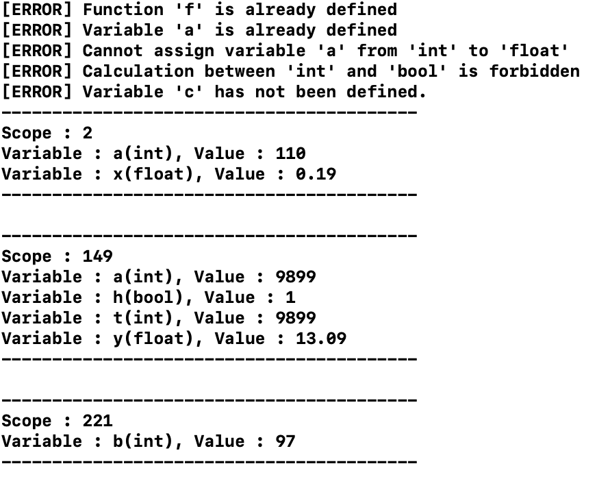

# CompilerProject3 : Semantic Analyzer


## Functions

#### a. Declaration of  variables in differnt scope

```c++
// global variables : a, x
int a = 11+99;
float x = 1.19;

int main(){
    // you can still create the variable 'a' in another scope(MAIN)
    int a = 9900;
  	if(true){
      	// variable 'a' in the new scope(IF)
      	int a = 9991;
    }
}
```


#### b. Assignment of variables && Calculation between variables or constants

```c++
// step into another scope
    if(true){
        // declare variable b, assign it as the result of RHS(based on precedence of different operators)
        int b = a-10000+(98*2+1);
    }
    // bool calculation
    bool h = 1<(2*3+4+a);
    
    // '--a' makes a = 9900 - 1 = 9989, but in calculation of 't' serves as 9990(new value)
    int t = --a;
```


#### c. Definition of functions

```c++
// define function without parameters
void g(){
    int x= 1;
}

//define function with two parameters
int f(int a, int b){
    int t = a*b;
    return t+a+b;
}
```


## Errors

#### a. Variables redefined in the same scope

```c++
int a = 9900;
    
//error : redefinition of variable 'a'
int a = 0;
```


#### b. Variables assigned as a differnt type

```c++
// error : cannot assign variable 'i'(int) as float
int i = 1.11;
```


#### c. Variables not defined yet in use

```
//error : variable 'c' is not defined
c = a;
```


#### d. Calculation between differnt types

```
//error : calculation between 'bool' and 'int' is illegal
h = 1+true;
```


#### e. Function redefined

```
// error : redefinition of function 'f'
int f(){
    return 0;
}
```


## Testing

#### a. Full Testing code

```c++
// define function without parameters
void g(){
    int x= 1;
}

//define function with two parameters
int f(int a, int b){
    int t = a*b;
    return t+a+b;
}

// error : redefinition of function 'f'
int f(){
    return 0;
}

// global variables : a, x
int a = 11+99;
float x = 1.19;


int main(){
    // you can still create the variable 'a' in another scope
    int a = 9900;
    
    //error : redefinition of variable 'a'
    int a = 0;
    
    // error : cannot assign variable 'a'(int) as float
    a = 1.11;
    
    // 'x--' makes x = 1.19 - 1 = 0.19, but in calculation of 'y' serves as 1.19(old value)
    float y = (x--)+11.9;
    
    // step into another scope
    if(true){
        // declare variable b, assign it as the result of RHS(based on precedence of different operators)
        int b = a-10000+(98*2+1);
    }
    // bool calculation
    bool h = 1<(2*3+4+a);
    
    //error : calculation between 'bool' and 'int' is illegal
    h = 1+true;
    
    // '--a' makes a = 9900 - 1 = 9989, but in calculation of 't' serves as 9990(new value)
    int t = --a;
    
    //error : variable 'c' is not defined
    c = a;
}


```


#### b. Results



